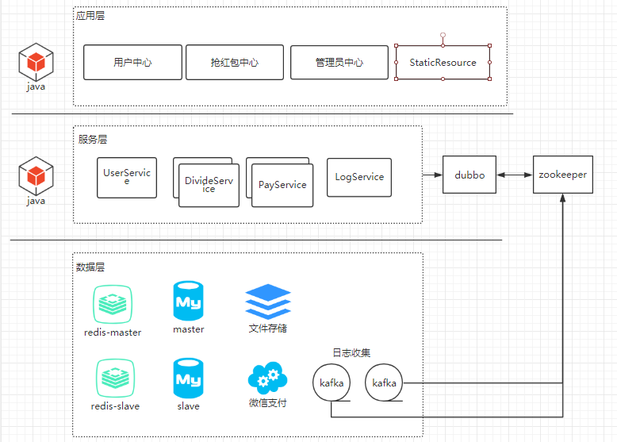
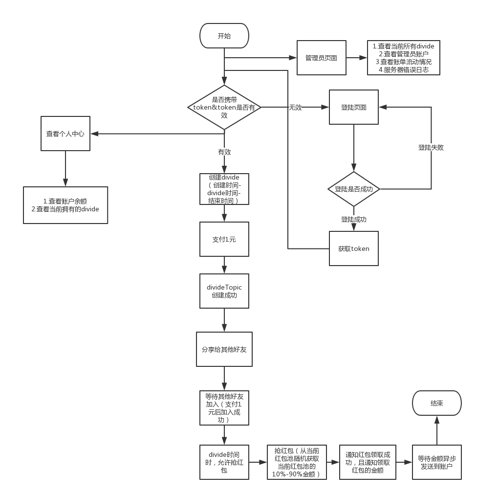

# myshop-web
抢红包dubbo项目，实现效果：先通过“集资”的方式凑集红包金额，当到达触发时间，红包开启，此时参加过“集资”的用户可以抢红包。

### 技术选型

1. zookeeper、dubbo管理协调服务
2. kafka做日志收集
3. mysql做数据持久化
4. redis做为缓存，支撑并发抢

### 模块介绍

myshop-parent：作为service层中provider模块的父依赖项目，用于jar包的版本控制

service-support：作为service层中api模块的父依赖项目，用于定义统一规范的api

user-service：user-service层项目，有api和provier模块

divide-service：divide-service层项目，有api和provier模块

pay-service：pay-service层项目，有api和provier模块

log-service：log-service层项目，有api和provier模块

### 系统架构

zookeeper、dubbo管理服务

kafka做日志收集

应用层：用户中心、抢红包中心、管理员中心

服务层：用户服务、divide服务、支付服务、日志服务

数据层：redis、mysql

第三方支撑服务：云存储、微信支付

### 业务流程

核心抢红包逻辑：

先抢到红包的人有机会拿到最大的divide金额

从当前红包池随机获取当前红包池的10%-90%的金额 

​            

实现原理：

预处理：将红包prefetch到redis，按如上规则形成金额list

抢红包：从list中pop金额（且需要控制不允许用户多次抢），成功后异步支付给用户

抢红包时间过期：比较redis和mysql中的数据，进行对账